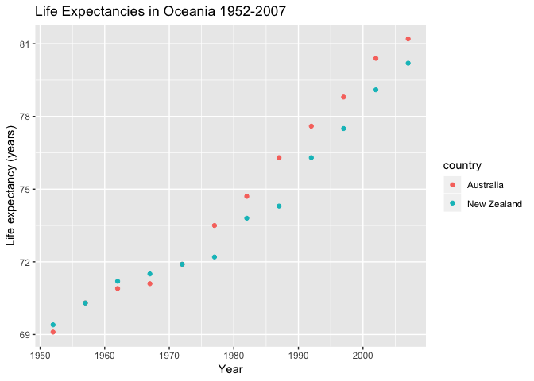

hw04CarolineSeip
================
Caroline Seip
October 3, 2018

Table of Contents
=================

-   Part 1: Activity \#2
-   Load packages
-   Make a tidy table
-   Make an untidy table
-   Make a scatterplot
-   Part 2: Activity \#2
-   Create data frames
-   Left join
-   Right join
-   Inner join
-   Full join

Data reshaping: Activity \#2
============================

**The prompt I have chosen to explore is Activity 2:**

-   Make a tibble with one row per year and columns for life expectancy for two or more countries
-   Use knitr::kable() to make this table look pretty in your rendered homework
-   Take advantage of this new data shape to scatterplot life expectancy for one country against that of another

Load packages
-------------

First let's load the dataset, tidyverse and knitr:

``` r
#Load gapminder dataset
library(gapminder)
#Load tidyverse to use dplyr and ggplot
library(tidyverse)
```

    ## ── Attaching packages ─────────────────────────────── tidyverse 1.2.1 ──

    ## ✔ ggplot2 3.0.0     ✔ purrr   0.2.5
    ## ✔ tibble  1.4.2     ✔ dplyr   0.7.6
    ## ✔ tidyr   0.8.1     ✔ stringr 1.3.1
    ## ✔ readr   1.1.1     ✔ forcats 0.3.0

    ## ── Conflicts ────────────────────────────────── tidyverse_conflicts() ──
    ## ✖ dplyr::filter() masks stats::filter()
    ## ✖ dplyr::lag()    masks stats::lag()

``` r
#Load knitr to use the kable function
library(knitr)
```

Make a tidy table
=================

Now let's make a formatted table of life expectancy for each year in Australia and New Zealand:

``` r
#Create an object 'OceaniaLifeExp' to store the data in
OceaniaLifeExp <- 
  #Use the gapminder dataset
  gapminder %>%
  #Filter so that we are only using Oceania (Australia and New Zealand)
  filter(continent=="Oceania") %>% 
  #Round the life expectancies off to one decimal place
  mutate(lifeExp = round(lifeExp, 1)) %>% 
  #Select the columns country, year and life expectancy
  select(country, year, lifeExp)
  #Make a tidy table using the 'kable' function, rename column headings
  kable(OceaniaLifeExp, col.names = c("Country", "Year", "Life expectancy (years)"))
```

| Country     |  Year|  Life expectancy (years)|
|:------------|-----:|------------------------:|
| Australia   |  1952|                     69.1|
| Australia   |  1957|                     70.3|
| Australia   |  1962|                     70.9|
| Australia   |  1967|                     71.1|
| Australia   |  1972|                     71.9|
| Australia   |  1977|                     73.5|
| Australia   |  1982|                     74.7|
| Australia   |  1987|                     76.3|
| Australia   |  1992|                     77.6|
| Australia   |  1997|                     78.8|
| Australia   |  2002|                     80.4|
| Australia   |  2007|                     81.2|
| New Zealand |  1952|                     69.4|
| New Zealand |  1957|                     70.3|
| New Zealand |  1962|                     71.2|
| New Zealand |  1967|                     71.5|
| New Zealand |  1972|                     71.9|
| New Zealand |  1977|                     72.2|
| New Zealand |  1982|                     73.8|
| New Zealand |  1987|                     74.3|
| New Zealand |  1992|                     76.3|
| New Zealand |  1997|                     77.5|
| New Zealand |  2002|                     79.1|
| New Zealand |  2007|                     80.2|

Make an untidy table
--------------------

This is great, but we want to organize the data now so that we only have one row for each year, so we are making the data 'untidy':

``` r
#Use the 'spread' command to untidy the data, specify the key (column titles) and value (column values)
spread(OceaniaLifeExp, key = "country", value = "lifeExp") %>% 
  #Make a pretty table using the 'kable' command, and specify column names
  kable(col.names = c("Year", "Australia", "New Zealand"))
```

|  Year|  Australia|  New Zealand|
|-----:|----------:|------------:|
|  1952|       69.1|         69.4|
|  1957|       70.3|         70.3|
|  1962|       70.9|         71.2|
|  1967|       71.1|         71.5|
|  1972|       71.9|         71.9|
|  1977|       73.5|         72.2|
|  1982|       74.7|         73.8|
|  1987|       76.3|         74.3|
|  1992|       77.6|         76.3|
|  1997|       78.8|         77.5|
|  2002|       80.4|         79.1|
|  2007|       81.2|         80.2|

Make a scatterplot
------------------

Now let's make a scatterplot to compare life expectancy in New Zealand and Australia:

``` r
#Use the previously created object 'OceaniaLifeExp'
OceaniaLifeExp %>% 
  #Use ggplot and specify the aesthetics (x and y), 'year' and 'lifeExp'
  ggplot(aes(year, lifeExp)) +
  #Add a scatterplot, colour the points by country
  geom_point(aes(colour= country)) +
  #Add a title
  ggtitle("Life Expectancies in Oceania 1952-2007") +
  #Add x and y labels
  xlab("Year") +
  ylab("Life expectancy (years)")
```



Part 2: Activity 2
==================

Create data frames
------------------

For this exercise, I will join two small data frames, `CanadianBears`:

``` r
#Make a data frame of Canadian bear species
CanadianBears <- "
Common name, Genus, Species
Grizzly bear, Ursus, Arctos
Black bear, Ursus, Americanus
Polar bear, Ursus, Maritimus
"
#Use 'read_csv' to switch the csv you just made into a table
#Specify 'skip = 1' to indicate that the first row of data is column headers
CanadianBears <- read_csv(CanadianBears, skip = 1)
#Take a look at what the data frame you made looks like
CanadianBears %>% 
  kable()
```

| Common name  | Genus | Species    |
|:-------------|:------|:-----------|
| Grizzly bear | Ursus | Arctos     |
| Black bear   | Ursus | Americanus |
| Polar bear   | Ursus | Maritimus  |

And `UrsusSpeciesMeanings`:

``` r
UrsusSpeciesMeanings <- "
Species, Meaning
Arctos, Northern
Americanus, American
Maritimus, Coastal
Thibetanus, Tibetan
"
#Use 'read_csv' to switch the csv you just made into a table
#Specify 'skip = 1' to indicate that the first row of data is column headers
UrsusSpeciesMeanings <- read_csv(UrsusSpeciesMeanings, skip = 1)
#Take a look at what the data frame you made looks like
UrsusSpeciesMeanings %>% 
  kable()
```

| Species     | Meaning  |
|:------------|:---------|
| Arctos      | Northern |
| Americanus  | American |
| Maritimus   | Coastal  |
| Thibetanus  | Tibetan  |
| \#\#Joining |          |

`Join` is a `dplyr` function that joins datasets by matching common variables between the datasets.

### Left join

Keeps the data on the left side of the function.

A left join will join matching rows **from** `UrsusSpeciesMeanings' **to**`CanadianBears`, using the matching`Species\` variable:

``` r
left_join(CanadianBears, UrsusSpeciesMeanings) %>% 
  kable()
```

    ## Joining, by = "Species"

| Common name  | Genus | Species    | Meaning  |
|:-------------|:------|:-----------|:---------|
| Grizzly bear | Ursus | Arctos     | Northern |
| Black bear   | Ursus | Americanus | American |
| Polar bear   | Ursus | Maritimus  | Coastal  |

Only species meanings with a matching Canadian bear are shown.

### Right join

Keeps the data on the right side of the function.

A right join will joing matching rows **from** `CanadianBears` **to** `UrsusSpeciesMeanings`:

``` r
right_join(CanadianBears, UrsusSpeciesMeanings) %>% 
  kable()
```

    ## Joining, by = "Species"

| Common name  | Genus | Species    | Meaning  |
|:-------------|:------|:-----------|:---------|
| Grizzly bear | Ursus | Arctos     | Northern |
| Black bear   | Ursus | Americanus | American |
| Polar bear   | Ursus | Maritimus  | Coastal  |
| NA           | NA    | Thibetanus | Tibetan  |

No matching Canadian bears value for Tibetan bear, therefore shows NA.

### Inner join

Keeps only data that has both left and right values:

``` r
inner_join(CanadianBears, UrsusSpeciesMeanings) %>% 
  kable()
```

    ## Joining, by = "Species"

| Common name  | Genus | Species    | Meaning  |
|:-------------|:------|:-----------|:---------|
| Grizzly bear | Ursus | Arctos     | Northern |
| Black bear   | Ursus | Americanus | American |
| Polar bear   | Ursus | Maritimus  | Coastal  |

Tibetan bear data is lost because there is no match in Canadian bears dataset.

### Full join

Keeps all the data, even if it doesn't have a match:

``` r
full_join(CanadianBears, UrsusSpeciesMeanings) %>% 
  kable()
```

    ## Joining, by = "Species"

| Common name  | Genus | Species    | Meaning  |
|:-------------|:------|:-----------|:---------|
| Grizzly bear | Ursus | Arctos     | Northern |
| Black bear   | Ursus | Americanus | American |
| Polar bear   | Ursus | Maritimus  | Coastal  |
| NA           | NA    | Thibetanus | Tibetan  |

Tibetan bear data is retained even though it doesn't have a left match.

Merging
-------

`Merge` is a base R function that joins two data frames by their common columns names.

``` r
merge(CanadianBears, UrsusSpeciesMeanings) %>% 
  kable()
```

| Species    | Common name  | Genus | Meaning  |
|:-----------|:-------------|:------|:---------|
| Americanus | Black bear   | Ursus | American |
| Arctos     | Grizzly bear | Ursus | Northern |
| Maritimus  | Polar bear   | Ursus | Coastal  |

Unlike with the `join` function, R does not tell us what variable it is using to match up the two datasets. It has also reordered the variables so that they are in an order that doesn't really make sense anymore.
